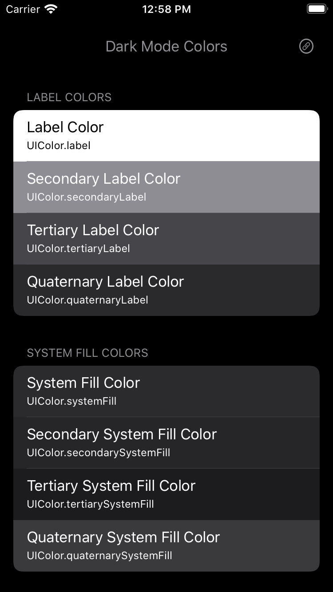
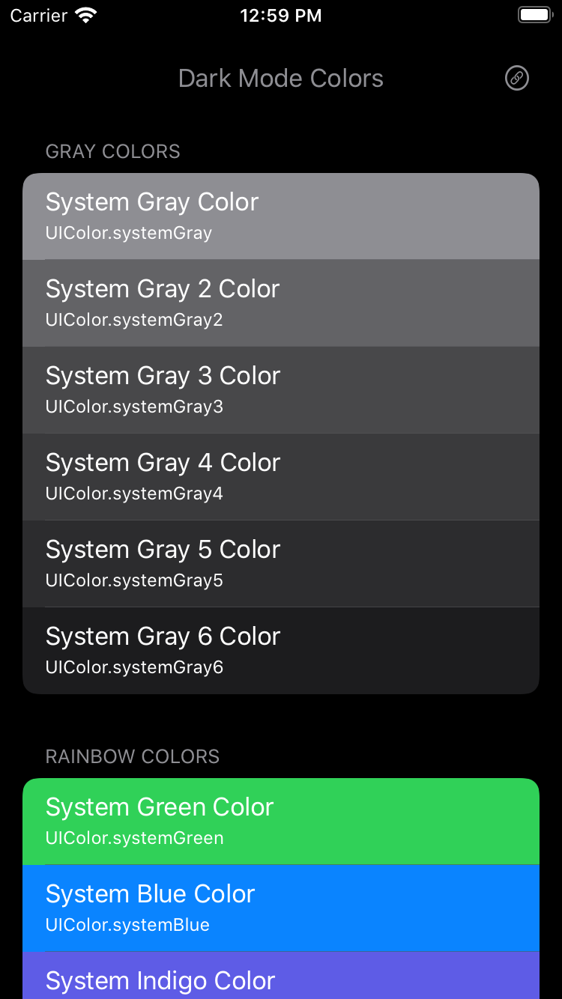

# DarkModeColors
For iOS Developers: View all system colors that vary depending on the iOS trait environment. Check how each color looks in dark and regular modes. 

**Description:** \
Provide a 1024x1024 pixel image to generate the required Apple app icon sets for the various device types. \
Provide a 3x pixel image to generate 1x, 2x, 3x image set i.e. provide a 300x300 pixel image for a 100x100 point image set. 

**Features:** 
- View is of list of system colors.
- Web link to Human Interface Guidelines.

*Example  (shown in Regular mode)*

*Example  (shown in Dark mode)*

**Technical Info:** \
Xcode project written in Swift 5\
Requires Xcode 11

**Installations:**
1. Open project in Xcode
2. Go to project settings for the target and update the your signing information(signing and capabilities)
3. Build and run the app in Xcode. 
4. Use Similator menu "Toggle Appearance" or [Shift] [Command] [A] to switch modes. 

**Author:** \
Marcy Vernon [@MarcyVernon](https://twitter.com/MarcyVernon)

**License:** \
"Dark Mode Colors" is under the MIT license. See [LICENSE](/LICENSE) for more information.
