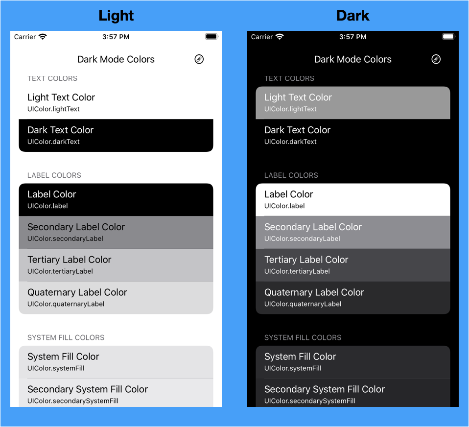

# DarkModeColors
For iOS Developers: View all system colors that vary depending on the iOS trait environment. Check how each color looks in dark and regular modes. 

**Features:** 
- View is of list of system colors.
- Web link to Human Interface Guidelines.

*Example  (shown in Light and Dark modes)*

**Technical Info:** \
Xcode project written in Swift 5\
Requires Xcode 11

**Installations:**
1. Open project in Xcode
2. Go to project settings for the target and update the your signing information(signing and capabilities)
3. Build and run the app in Xcode. 
4. Use Similator menu "Toggle Appearance" or [Shift] [Command] [A] to switch modes. 

**Author:** \
Marcy Vernon [@MarcyVernon](https://twitter.com/MarcyVernon)

**License:** \
"Dark Mode Colors" is under the MIT license. See [LICENSE](/LICENSE) for more information.
